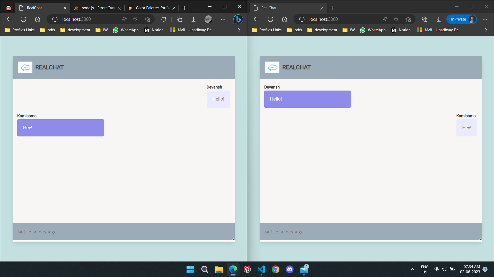

# Real-Time Chat Web App
Welcome to the Real-Time Chat Web App! This application enables real-time communication between users, allowing them to chat seamlessly in a dynamic and interactive environment.

# Features
• Real-time messaging: Experience instant message updates without the need to refresh the page.\
• User-friendly interface: Enjoy a clean and intuitive chat interface for easy communication.\
• Event-driven architecture: Utilizes Socket.IO for efficient bidirectional communication between the client and server.

# Prerequisites
To run the Real-Time Chat Web App locally, ensure you have the following installed:

1. Node.js
2. Express.js
3. Socket.IO
4. Any modern web browser

# Installation
1. Clone the repository: git clone (https://github.com/DevanshUpadhyay26/RealTimeChat/tree/master)
2. Navigate to the project directory: cd real-time-chat-web-app
3. Install the dependencies: npm install

# Usage
• Start the server: node server.js\
• Open your web browser and visit http://localhost:3000 \
• Enter your name when prompted\
• Start chatting in real-time!

# Code Overview
The Real-Time Chat Web App consists of two main components: the client-side code and the server-side code.

1. Client-side
• The client-side code is responsible for rendering the chat interface and handling user interactions. The main JavaScript file for the client-side code is public/main.js.

Here's an overview of the key components:

• sendMessage(message): Sends a message to the server and updates the chat interface.\
• appendMessage(msg, type): Appends a message to the chat interface, distinguishing between outgoing and incoming messages.\
• scrollToBottom(): Scrolls the chat interface to the latest message.

2. Server-side
The server-side code handles the WebSocket communication and broadcasts messages to connected clients. The main JavaScript file for the server-side code is server.js.

Here's a brief explanation of the server-side functionality:

• io.on('connection', (socket) => { ... }): Listens for client connections and handles events.\
• socket.on('message', (msg) => { ... }): Listens for incoming messages from clients and broadcasts them to other connected clients.

# Contributing
Contributions are what make the open source community such an amazing place to be learn, inspire, and create. Any contributions you make are **greatly appreciated**.

1. Fork the Project
2. Create your Feature Branch (`git checkout -b feature/AmazingFeature`)
3. Commit your Changes (`git commit -m 'Add some AmazingFeature'`)
4. Push to the Branch (`git push origin feature/AmazingFeature`)
5. Open a Pull Request

Thank you for using the Real-Time Chat Web App! Start chatting in real-time and enjoy seamless communication with your friends and colleagues. If you have any questions or need assistance, please don't hesitate to reach out.

Happy chatting! 🚀🌐
